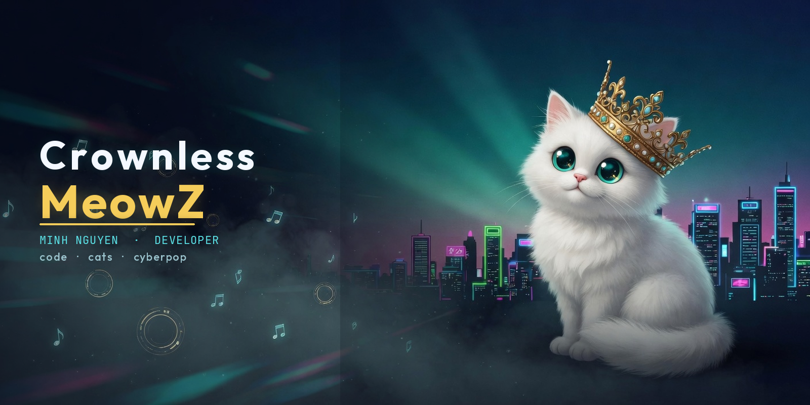
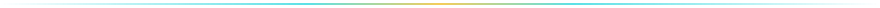

  

 

  

<h1 align="center">Minh Nguyen</h1>

  

  
  
  

  
  
  
  
  

 

### About me

Xin chào — mình là **Minh Nguyen** (`CrownlessMeowZ`). Mình thích biến những thứ mình yêu thành sản phẩm web: rhythm game UI, neon glassmorphism, và một chút chaos dễ thương.

- 🎮 Fan **Hatsune Miku: Project DIVA** — đang xây [Project DIVA Web](https://crownlessmeowz.github.io/Project-DIVA-Web/)
- 💻 JavaScript · React · CSS · đang học Java / Spring Boot
- 🤖 Tò mò về AI agents (financial research, Vietnamese AI products)
- 🇻🇳 Vietnam

 

### Featured project

<table>
  <tr>
    <td width="180" align="center" valign="top">
       
      
        
      
    </td>
    <td valign="top">
      <h3><a href="https://github.com/CrownlessMeowZ/Project-DIVA-Web">Project DIVA Web</a></h3>
      

        Fan-facing web experience cho series <b>Hatsune Miku: Project DIVA</b> — characters, modules, songs, timeline, producers, concerts.
        UI cyberpop glassmorphism, bilingual <b>EN / VI</b>.
      

      

        <b>Stack:</b> React 19 · Vite · React Router · i18next · CSS
        &nbsp;·&nbsp;
        <a href="https://crownlessmeowz.github.io/Project-DIVA-Web/">Play live →</a>
      

    </td>
  </tr>
</table>

 

### Stats

  
  

 

  

 

### Contribution snake

  <picture>
    <source media="(prefers-color-scheme: dark)" srcset="./assets/github-contribution-grid-snake-dark.svg" />
    <source media="(prefers-color-scheme: light)" srcset="./assets/github-contribution-grid-snake.svg" />
    
  </picture>

 

  <i>No crown. Just claws, code, and a little chaos.</i>

